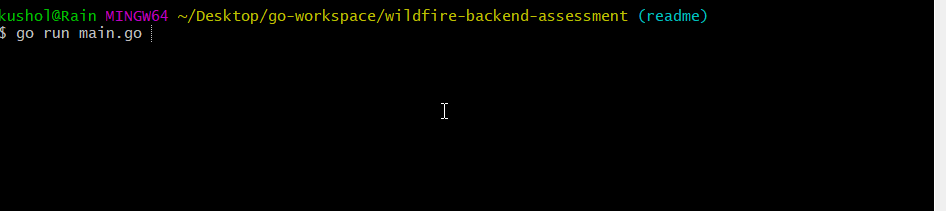

# Wildfire Backend Assessment
An app that fetches a random name and joke, and combines them.

## APIs Used

  - https://names.mcquay.me/api/v0
  - http://api.icndb.com/jokes/random?firstName=John&lastName=Doe&limitTo=nerdy
## Technologies Used

  - Go


  ## Features
 1. User can view a random joke

## Preview
 

 ## Development

 ### Getting Started
 1. Clone the repository
    ``` bash
    git clone https://github.com/kusholhuq/wildfire-backend-assessment.git
    cd wildfire-backend-assessment
    ```
 1. Once in the project directory, run the main.go file
    ``` bash
    go run main.go
    ```
